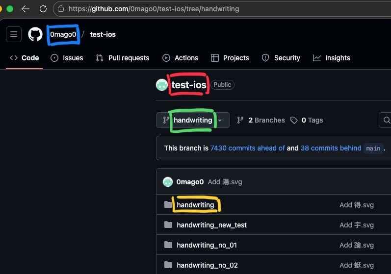

# 漢字手寫練習 App

一款 iOS 手寫練習應用程式，讓使用者練習書寫漢字，並可將手寫結果上傳至 GitHub 儲存。

## ✨ 功能特色

- **手寫練習**：使用 PencilKit 或自訂繪圖模式書寫漢字
- **字庫系統**：內建千字文字庫，也可從網址載入自訂字庫
- **進度追蹤**：記錄已完成的漢字，查看學習進度
- **GitHub 整合**：將手寫作品直接上傳至 GitHub 儲存庫
- **流暢的卡片輪播**：左右滑動切換不同漢字
- **可調整畫布**：支援調整筆刷粗細與畫布縮放

## �️ 系統需求

- **iOS 裝置**：iOS 15.0 或更新版本
- **開發環境**：macOS 搭配 Xcode 14.0+
- **Apple ID**：需要免費或付費的 Apple 開發者帳號

## 📦 編譯與安裝

### 步驟 1：下載專案

```bash
git clone https://github.com/0mago0/test-ios.git
cd test-ios
```

### 步驟 2：使用 Xcode 開啟專案

```bash
open a.xcodeproj
```

或手動在 Finder 中雙擊 `a.xcodeproj` 開啟。

### 步驟 3：設定開發者帳號

1. 在 Xcode 中，點擊左側專案導覽器中的 **a** 專案（藍色圖示）
2. 選擇 **Signing & Capabilities** 標籤
3. 在 **Team** 下拉選單中選擇你的 Apple ID
   - 若尚未登入，點擊 **Add Account...** 並使用你的 Apple ID 登入
   - 免費的 Apple ID 即可，不需付費開發者帳號
4. 確保 **Automatically manage signing** 已勾選
5. 若出現 Bundle Identifier 衝突，將其改為獨特的名稱，例如：
   ```
   com.yourname.handwriting-practice
   ```

### 步驟 4：連接 iOS 裝置

1. 使用傳輸線將 iPhone 或 iPad 連接至 Mac
2. 在裝置上點擊 **信任此電腦**
3. 在 Xcode 上方的裝置選擇器中，選擇你的實體裝置（非模擬器）

### 步驟 5：開啟開發者模式（iOS 16+）

iOS 16 及更新版本需要先啟用開發者模式才能安裝開發中的 App：

1. 在 iPhone/iPad 上開啟 **設定**
2. 前往 **隱私權與安全性**（滑到最下方）
3. 點擊 **開發者模式**
4. 將開關切換為 **開啟**
5. 系統會提示需要重新啟動裝置，點擊 **重新啟動**
6. 重啟後會出現確認對話框，點擊 **開啟** 確認啟用

> ⚠️ 若找不到「開發者模式」選項，請先用 Xcode 嘗試編譯一次（即使失敗），該選項就會出現。

### 步驟 6：編譯並安裝

1. 按下 `Cmd + R` 或點擊左上角的 ▶️ 按鈕
2. Xcode 會自動編譯並將 App 安裝到你的裝置上
3. 首次安裝可能需要 1-2 分鐘

### 步驟 7：信任開發者（首次安裝）

首次安裝時，iOS 會阻止 App 執行。請依照以下步驟解除限制：

1. 在 iPhone/iPad 上開啟 **設定**
2. 前往 **一般** → **VPN 與裝置管理**
3. 在「開發者 App」區塊中，點擊你的 Apple ID
4. 點擊 **信任「你的 Apple ID」**
5. 確認信任後，即可正常開啟 App

### 常見問題

#### ❌ 出現 "Untrusted Developer" 錯誤
請參照上方「步驟 6：信任開發者」設定。

#### ❌ 出現 Signing 錯誤
- 確認已選擇正確的 Team（你的 Apple ID）
- 嘗試更改 Bundle Identifier 為獨特的名稱
- 確保裝置已連接網路（Xcode 需驗證憑證）

#### ❌ App 7 天後無法開啟
使用免費 Apple ID 簽署的 App 有效期為 7 天。過期後需重新連接 Mac 並執行 `Cmd + R` 重新安裝。

> 💡 **提示**：付費 Apple Developer Program（年費 $99 USD）可獲得 1 年有效期的簽署憑證。

#### ❌ 編譯時出現 "No signing certificate" 錯誤
1. 前往 Xcode → Settings → Accounts
2. 選擇你的 Apple ID
3. 點擊 **Manage Certificates**
4. 點擊左下角 **+** 號，新增 **Apple Development** 憑證

## ⚙️ 設定

### 創建 GitHub 儲存庫教學

<details>
<summary>創建 GitHub 儲存庫教學</summary>

若尚未擁有儲存庫，可依以下步驟創建：

1. 登入 [GitHub](https://github.com)。
2. 點擊右上角的 **+** 按鈕，選擇 **New repository**。
3. 填寫儲存庫名稱（例如：`test-ios`）。
4. 選擇 **Public** 或 **Private**，根據需求設定儲存庫的可見性。
5. 勾選 **Add a README file**（可選）。
6. 點擊 **Create repository** 按鈕完成創建。

完成後，將儲存庫的名稱（例如：`test-ios`）填入 App 的 GitHub 設定頁面中對應的 **Repo** 欄位。
</details>


### GitHub 上傳設定

若要使用 GitHub 上傳功能，需在 App 設定頁面中填入：



**圖片標記說明：**
- 🔵 **藍色框**：Owner（GitHub 使用者名稱）
- 🔴 **紅色框**：Repo（儲存庫名稱）
- 🟢 **綠色框**：Branch 分支名稱
- 🟡 **黃色框**：路徑前綴

| 欄位 | 說明 |
|------|------|
| **Owner** | 自己的 GitHub 使用者名稱或組織名稱 |
| **Repo** | 儲存庫名稱 |
| **Branch** | 分支名稱（預設為 `main`） |
| **路徑前綴** | 檔案存放路徑前綴（預設為 `handwriting`） |
| **GitHub Token** | 具有 `contents:write` 權限的 Personal Access Token |

> 💡 建議使用 Fine-grained Personal Access Token，僅對目標 repo 開啟 contents:write 權限。
### 自訂字庫

1. 準備一個 `.txt` 純文字檔案，內容為要練習的漢字
2. 將檔案放置於可公開存取的網址
3. 在設定頁面中輸入網址並載入

若不設定，App 將使用內建的千字文字庫。

## 🏗️ 專案結構

```
a/
├── aApp.swift              # App 入口
├── ContentView.swift       # 主視圖
├── CharacterLoader.swift   # 字庫載入管理器
├── Helpers/
│   ├── GHKeys.swift        # GitHub 設定鍵值常數
│   └── KeychainHelper.swift # Keychain 存取輔助
├── Models/
│   └── StrokePoint.swift   # 筆畫資料模型
├── Services/
│   └── GitHubService.swift # GitHub API 服務
└── Views/
    ├── Components/
    │   ├── Crosshair.swift         # 十字準心元件
    │   ├── PKCanvasViewWrapper.swift # PencilKit 畫布封裝
    │   ├── SimpleDrawingView.swift # 簡易繪圖視圖
    │   └── ToastView.swift         # Toast 提示元件
    └── Screens/
        ├── DrawingView.swift       # 主繪圖頁面
        ├── GitHubSettingsView.swift # GitHub 設定頁面
        └── ProgressSheetView.swift  # 進度顯示頁面
```

## 🔧 技術棧

- **SwiftUI** - 現代化 UI 框架
- **PencilKit** - Apple Pencil 手寫支援
- **Keychain** - 安全儲存敏感資訊
- **GitHub REST API** - 檔案上傳整合

---

如有任何問題或建議，歡迎提交 Issue 或 Pull Request！
